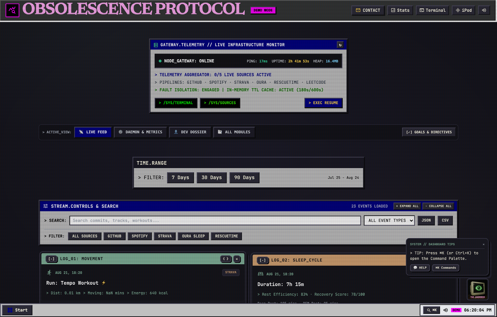
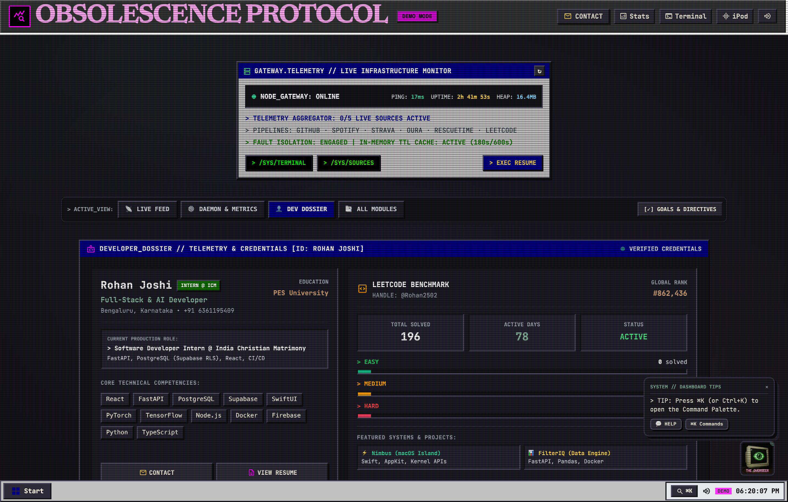
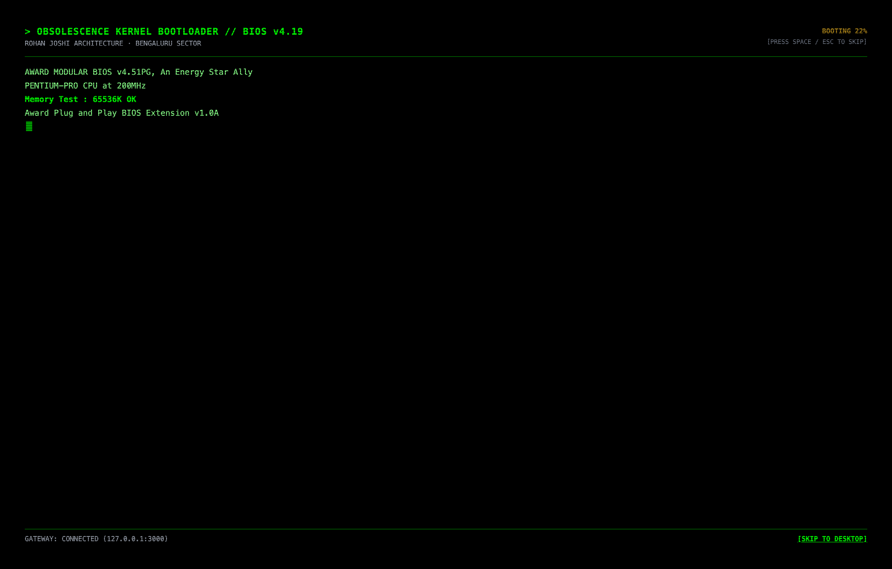

# OBSOLESCENCE PROTOCOL 🖥️
> **A full-stack retro-brutalist personal life-logging operating system & telemetry dashboard.**

[](https://github.com/rohanrjoshii/obsolescence-protocol)
[](https://reactjs.org/)
[](https://nodejs.org/)
[](https://vitejs.org/)
[](https://threejs.org/)

---

## 📸 System Previews (Real Browser Telemetry)

### 1. Main Dashboard & Live Telemetry Stream


### 2. Developer Dossier & Algorithmic Benchmarks (Rohan Joshi)


### 3. BIOS Splash Kernel Bootloader


---

## 🎨 Design Philosophy & Architecture

The **OBSOLESCENCE PROTOCOL** is engineered to bridge real-time developer activity with a 1995 MS-DOS / Windows 95 / Endacopia claymorphic aesthetic powered by WebGL CRT shaders and mechanical audio feedback:

* **Windows 95 + Claymorphism**: Classic navy blue titlebars (`#000080`), grey window chrome (`#c0c0c0`), and earthy Endacopia clay cards (sand `#d4a373`, sage `#81b29a`, terracotta `#e07a5f`, charcoal `#242330`).
* **True 64px Downsampled Hardware Pixelation**: Album covers and visual media are physically downsampled to a 64×64 pixel canvas and scaled via `transform: scale(3.5)` with `imageRendering: 'pixelated'` and a 5-stage green phosphor filter chain.
* **Mechanical Typewriter Machine Logic**: Dynamic logs, commit messages, and directives mechanically stream character-by-character while window borders remain static.
* **Curated Visual Hierarchy**: Single-line collapsible accordions for feed logs, expanded negative space (`gap-8`), and tabbed workspace routing (`[LIVE FEED]`, `[DAEMON & METRICS]`, `[DEV DOSSIER]`, `[ALL MODULES]`).

---

## ⚡ Key Features

* 📊 **Multi-Source Telemetry Reverse Gateway**: In-memory 180s TTL cache with fault-isolated parallel ingestion for GitHub commits, LeetCode benchmarks, Strava cycling sessions, Oura sleep cycles, and Spotify/YouTube audio streams.
* 🎵 **Off-Screen YouTube Audio Engine**: 16 curated studio masters (Daft Punk, The Weeknd, Kanye West, Cigarettes After Sex, Kavinsky, HOME, GUNSHIP, Harry Styles) on a retro iPod Classic with Three.js 3D CRT wireframe visualizer.
* 💻 **CMD.EXE Command Interpreter**: Interactive terminal prompt with history, arrow-key navigation, and 20+ commands (`neofetch`, `play <track>`, `cat resume.txt`, `boot`, `ping`, `stats`, `directives`, `memory`, `matrix`).
* 🔒 **PGP Secure Relay Transmitter**: Matrix-encrypted recruiter dispatch client with a 1.5-second cryptographic cipher scrambling animation.
* 📅 **24-Hour Daemon Cron Schedule**: 12-column tabular routine resembling a Linux `htop`/cron daemon monitor with live pulsing `[ACTIVE]` and `[ OK ]` tags.
* 📈 **Macro Odometer Registers (`0x70`–`0x75`)**: Real-time counter tracking lifetime commits, distance cycled, code hours, and papers read.

---

## 🚀 Quick Start

### 1. Clone Repository
```bash
git clone https://github.com/rohanrjoshii/obsolescence-protocol.git
cd obsolescence-protocol
```

### 2. Run Reverse Gateway Backend
```bash
# Install backend dependencies
npm install

# Start Express Gateway (Port 3000)
npm run dev
```

### 3. Run Retro OS Frontend
```bash
# Navigate to frontend
cd frontend

# Install frontend dependencies
npm install

# Launch Vite Dev Server (Port 5173)
npm run dev
```

Open **`http://localhost:5173`** in Google Chrome or any modern browser!

---

## 👤 Developer Credentials

* **Name:** Rohan Joshi
* **Location:** Bengaluru, Karnataka
* **Education:** BCA @ PES University, Bengaluru (2023 – 2026)
* **Production Role:** Software Developer Intern @ India Christian Matrimony (ICM)
* **GitHub:** [@rohanrjoshii](https://github.com/rohanrjoshii)
* **LinkedIn:** [@rohanrj1008](https://linkedin.com/in/rohanrj1008)
* **LeetCode:** [@Rohan2502](https://leetcode.com/u/Rohan2502/)

---

## 📄 License
MIT License © 2026 Rohan Joshi. All Rights Reserved.
